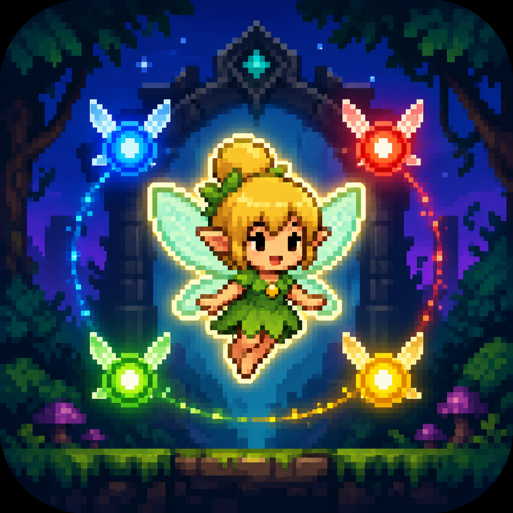
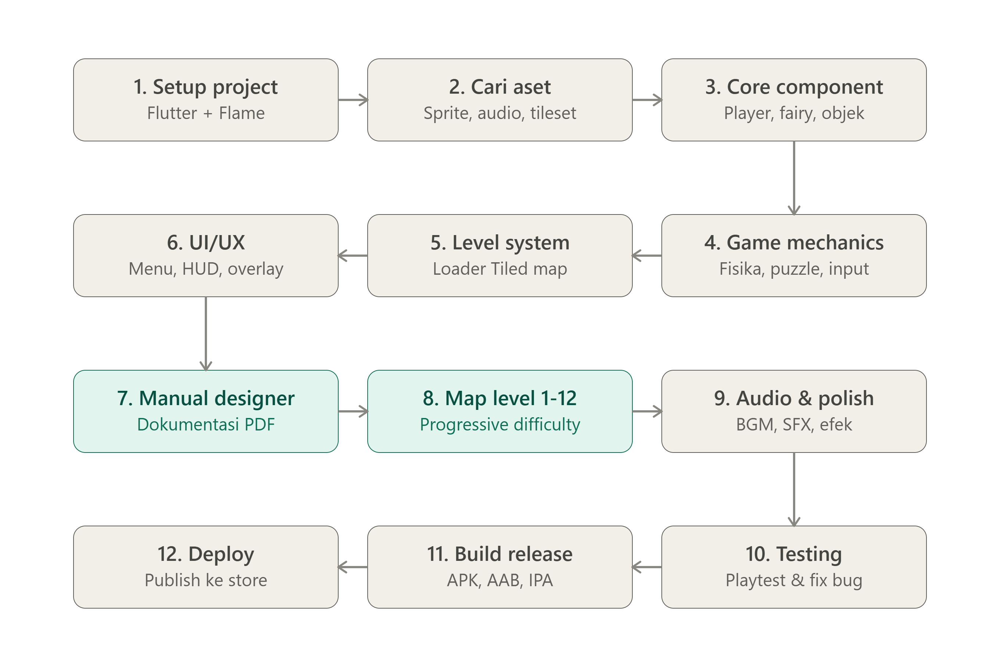

<p align="center">
  
</p>

<h1 align="center">Pairy</h1>

Pairy adalah game **2D platformer puzzle mobile** yang dibangun dengan **Flutter** dan **Flame Engine**. Pemain menjelajahi level demi level sambil dibantu oleh empat peri (fairy) berwarna — biru, merah, hijau, dan kuning — untuk memecahkan puzzle berbasis tuas (lever), gerbang (gate), dan air mancur (fountain) hingga mencapai pintu keluar.


---

## Alur pengerjaan



> Tahap 7 & 8 (manual map designer + desain level) bersifat iteratif — manual dibuat lebih dulu supaya map designer bisa membangun level 1–12 tanpa perlu menyentuh kode.

---

## Fitur & gameplay

- **Karakter utama** — berjalan dan melompat menyusuri level 2D pixel-art
- **4 peri pendamping** (biru, merah, hijau, kuning) — masing-masing berperan dalam mekanik puzzle
- **Objek puzzle interaktif** — tuas (lever), gerbang (gate), air mancur (fountain)
- **Exit gate** — tujuan akhir setiap level
- **12 level** dengan tingkat kesulitan meningkat secara bertahap

---

## Tech stack

| Komponen | Package |
|---|---|
| Framework | Flutter |
| Game engine | [flame](https://pub.dev/packages/flame) |
| Tilemap | [flame_tiled](https://pub.dev/packages/flame_tiled) |
| Audio | [flame_audio](https://pub.dev/packages/flame_audio) |
| Local storage | [shared_preferences](https://pub.dev/packages/shared_preferences) |
| Icon & splash | [flutter_launcher_icons](https://pub.dev/packages/flutter_launcher_icons), [flutter_native_splash](https://pub.dev/packages/flutter_native_splash) |

---

## Getting started

### Prasyarat
- [Flutter SDK](https://docs.flutter.dev/get-started/install) (channel stable, sesuai versi di `pubspec.yaml`)
- Android Studio / Xcode (tergantung target platform)
- Emulator atau perangkat fisik untuk testing

### Clone
```bash
git clone https://github.com/Magentakey/pairy-mobile-flame.git
cd pairy-mobile-flame
git checkout alt2
```

### Install dependencies
```bash
flutter pub get
```

### Jalankan (development)
```bash
flutter run
```

### Build (release)

**Android**
```bash
flutter build apk --release
# atau untuk Play Store
flutter build appbundle --release
```

**iOS**
```bash
flutter build ios --release
```

---

## Struktur project

```
pairy/
├── android/                # Konfigurasi native Android
├── ios/                     # Konfigurasi native iOS
├── assets/
│   ├── images/
│   │   ├── player/          # Sprite karakter utama (idle, walk, jump)
│   │   ├── fairy/           # Sprite 4 peri berwarna
│   │   ├── environment/     # Objek dunia: lever, gate, fountain
│   │   ├── exit_gate/        # Sprite pintu keluar
│   │   └── ui/               # Aset antarmuka
│   ├── tiles/                # Tileset untuk Tiled map
│   ├── maps/                 # File map (.tmx/.json) level 1-12
│   └── audio/
│       ├── sfx/               # Sound effect
│       └── bgm/               # Background music
├── lib/
│   ├── core/                  # Util & helper inti
│   ├── game/
│   │   ├── components/         # PlayerComponent, FairyComponent, dll
│   │   ├── level/               # Level loader & tile grid
│   │   ├── overlays/            # Overlay HUD, pause, win/lose
│   │   └── pairy_game.dart     # Entry point game (FlameGame)
│   ├── models/                  # Data model
│   ├── screens/                 # Halaman UI (menu, level select, dll)
│   ├── services/                 # Service (save/load, audio manager)
│   ├── widgets/                   # Widget Flutter reusable
│   └── main.dart
└── pubspec.yaml
```

---

## Referensi aset

Aset yang digunakan/direkomendasikan pada project ini:

| Jenis | Sumber | Lisensi |
|---|---|---|
| Sprite peri (fairy) | [Elthen's 2D Pixel Art Fairy Sprites](https://elthen.itch.io/2d-pixel-art-fairy-sprites) | Berbayar (~$1) |
| Sprite peri alternatif | [itch.io — tag fairy](https://itch.io/game-assets/tag-fairy) | Campuran gratis/berbayar |
| UI pack | [Kenney UI Pack](https://kenney.nl/assets/ui-pack) | CC0 (bebas pakai) |
| Environment / objek puzzle | [Kenney Pixel Platformer](https://kenney.nl/assets/pixel-platformer) | CC0 (bebas pakai) |
| Environment alternatif | [itch.io — tag puzzle-platformer](https://itch.io/game-assets/tag-puzzle-platformer) | Campuran gratis/berbayar |

Selalu cek ulang lisensi tiap aset sebelum publish ke store, khususnya untuk aset berbayar yang mungkin punya batasan penggunaan komersial.

---

## Manual map designer

Dokumentasi lengkap cara membuat level baru menggunakan **Tiled Map Editor** (aturan naming layer, konvensi ID lever-gate, dll) tersedia dalam bentuk PDF.

> 📄 **Status: belum tersedia** — link akan ditambahkan di sini setelah manual selesai dibuat.

---

## Roadmap level

- [ ] Level 1
- [ ] Level 2
- [ ] Level 3
- [ ] Level 4
- [ ] Level 5
- [ ] Level 6
- [ ] Level 7
- [ ] Level 8
- [ ] Level 9
- [ ] Level 10
- [ ] Level 11
- [ ] Level 12

---

## Contributing

Kontribusi terbuka untuk siapa saja yang ingin membantu — baik dari sisi kode, aset, maupun desain level. Silakan buka issue atau pull request.

---

## License

MIT License — bebas digunakan, dimodifikasi, dan didistribusikan dengan tetap menyertakan atribusi.